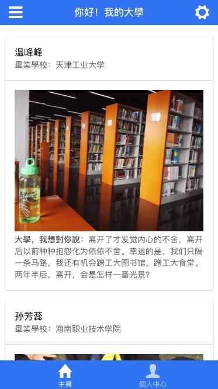
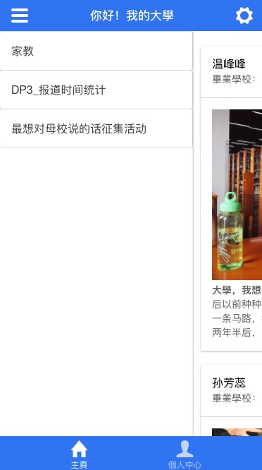
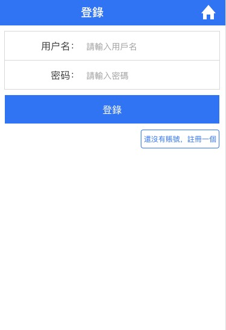
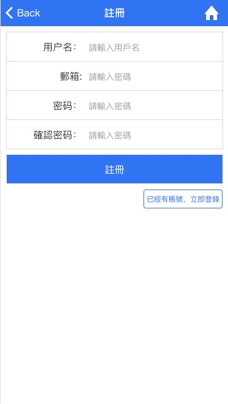

# 你好，大学项目
> gulp + ionic1
>
> 一个活动专题H5程序
## 声明
该程序创意来源于毕业后对母校的思念之情，虽然不能回母校看看，但是通过这个收集展示程序让更多像我这样怀念母校的小伙伴们有一个表达的平台。

## 参考资料

菜鸟教程里ionic的文档 : [http://www.runoob.com/ionic/ionic-tutorial.html](http://www.runoob.com/ionic/ionic-tutorial.html)

gulp文档 : [http://www.gulpjs.com.cn/docs/getting-started/](http://www.gulpjs.com.cn/docs/getting-started/)

## 技术栈
>1、ionic1项目目录构建【不是用脚手架】
>
>2、ionic上拉加载下拉刷新
>
>3、ionic的http请求
>
>4、gulp【本gulpfile.js可作为模版，注释的很详细】
>
>5、数据本地mock，前期是用本地数据mock的，后期才切换到服务器

## 实现功能
>1、首页，发表创意列表
>
>2、用户登陆
>
>3、用户注册
>
>4、侧滑栏


## 界面预览
>首页
>

>首页侧栏
>

>用户登陆
>

>用户注册
>



## 开启应用

``` bash
# 获取项目
git clone https://github.com/lsiten/mySchool.git

# 进入的项目目录
cd mySchool

# build for production with minification
gulp
```
